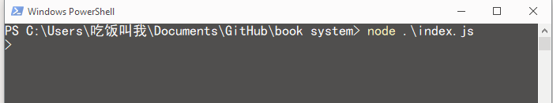
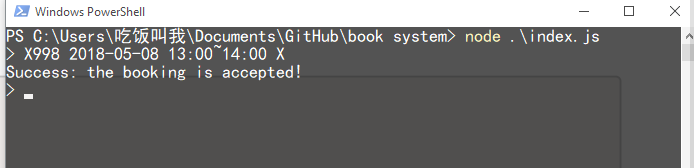
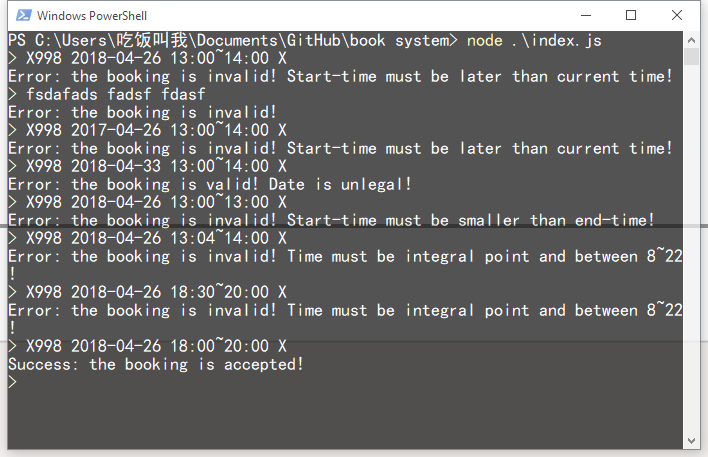
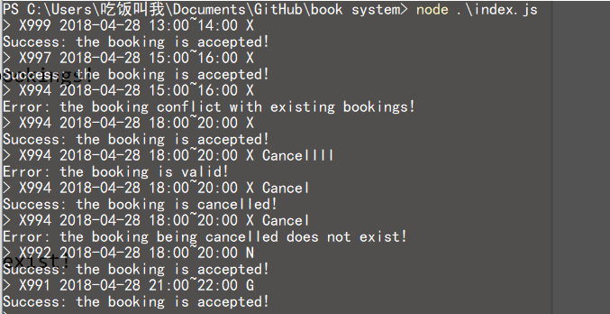
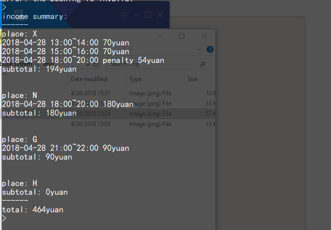
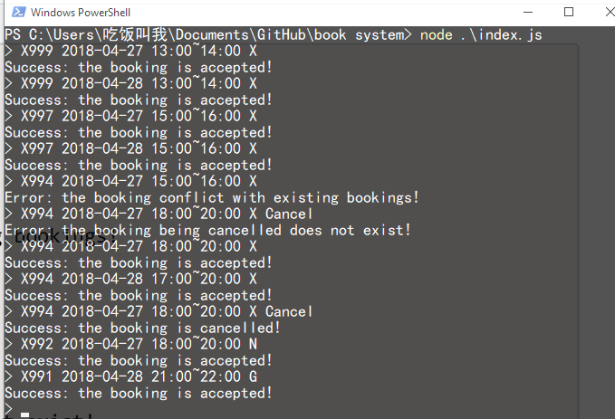
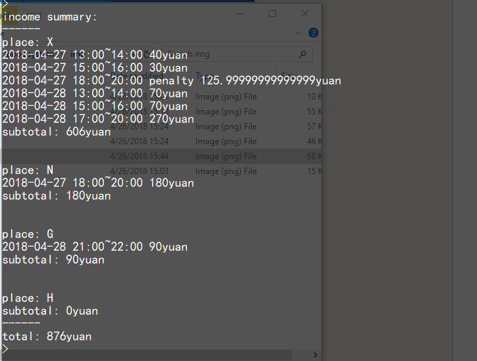

# 网球场地预约管理问题
----
**ps: pdf中写的违约金细则中，星期⼀到星期五收取全部费⽤的70%作为违约⾦金额，但是给的例子中是按50%计算的。我的代码中是按70%计算的。**

## How to start
切换到index.js所在目录，输入`node index.js`即可运行。

## Usage
每次输入一条预订信息回车即可看到结果。

## Test1
输入日期以及时间段必须合法：
+ 日期格式为`xxxx-xx-xx`(月份和日期也可以为一位数字)
+ 间段格式为`xx:xx~xx:xx`
+ 预订日期必须大于当前日期
+ 起始时间大于当前时间
+ 起始时间大于结束时间
+ 起始时间与结束时间都为整点，且在8-22点之间

预订的场地只能为`X, N, G, H`之一。
否则Throw error。

测试时时间为2018/4/26 15:08

## Test2
同一天内预订示例：测试2018/4/28(星期六)

其中取消预订只能以cancel方式，且必须与预订人相同，取消过预订在取消也会throw error。

输入空格即可查看当前预订以及收入信息。
(截图较长，所以分为了两张，望谅解)。

## Test3
两天的预订信息示例：测试2018/4/27(星期五)以及2018/4/28(星期六)

